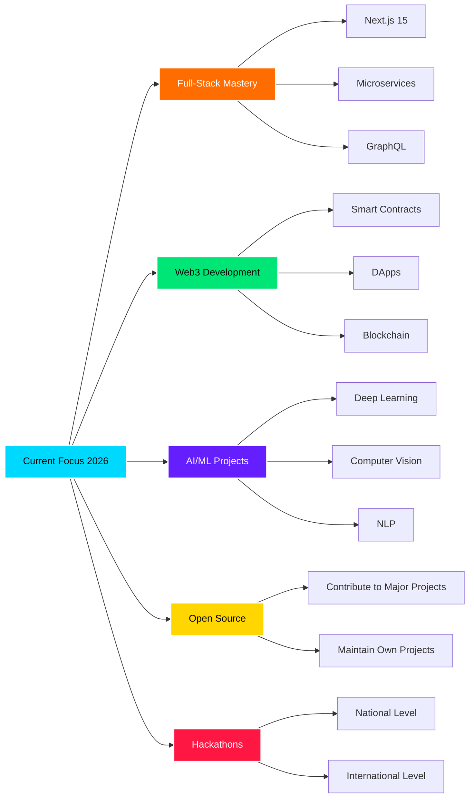

<!-- 
═══════════════════════════════════════════════════════════════════════════════
  GitHub Profile README - Devansh Rawat
  Professional Software Engineer Portfolio
  Last Updated: February 2026
═══════════════════════════════════════════════════════════════════════════════
-->

<div align="center">

<!-- Animated Header with 3D Effect -->


<!-- Typing Animation -->
<p align="center">
  
</p>

<!-- Profile Views Counter with Animation -->
<p align="center">
  
  
  
  
  
</p>

</div>

<!-- Animated Divider -->


<br/>

##  About Me

```typescript
const devansh = {
    name: "Devansh Rawat",
    title: "Software Engineer | Full-Stack Developer",
    education: {
        degree: "B.Tech Computer Science Engineering",
        university: "Graphic Era Hill University",
        year: "2027",
        achievements: ["Microsoft SEFA 2025", "Hackathon Participant"]
    },
    location: "India 🇮🇳",
    currentFocus: [
        "Building scalable full-stack applications",
        "Exploring Web3 & Blockchain technologies",
        "AI/ML model development & deployment",
        "Contributing to open-source projects",
        "Participating in competitive hackathons"
    ],
    techStack: {
        languages: ["JavaScript", "TypeScript", "Python", "Java", "C++", "C"],
        frontend: ["React", "Next.js", "HTML5", "CSS3", "Tailwind CSS", "Bootstrap"],
        backend: ["Node.js", "Express", "Flask", "MongoDB", "PostgreSQL", "MySQL"],
        aiml: ["TensorFlow", "PyTorch", "Scikit-learn", "Pandas", "NumPy"],
        web3: ["Ethereum", "Solidity", "Web3.js", "Smart Contracts"],
        tools: ["Git", "Docker", "VS Code", "Postman", "Linux", "AWS"],
        currently_learning: ["Microservices", "GraphQL", "Kubernetes", "Rust"]
    },
    passions: [
        "Problem Solving 🧩",
        "Building Real-World Solutions 💡",
        "Open Source Contribution 🌐",
        "Learning New Technologies 📚",
        "Hackathons & Competitions 🏆"
    ],
    funFact: "I debug with console.log() and I'm not ashamed! 😄"
};
```

<br/>

<!-- Animated Divider -->


<br/>

##  Tech Stack & Tools

<div align="center">

### 🎯 Languages
<p>
  
</p>

### 🎨 Frontend Development
<p>
  
</p>

### ⚙️ Backend Development
<p>
  
</p>

### 🗄️ Databases & Cloud
<p>
  
</p>

### 🤖 AI/ML & Data Science
<p>
  
  
  
  
</p>

### ⛓️ Web3 & Blockchain
<p>
  
  
  
  
</p>

### 🛠️ Tools & Technologies
<p>
  
</p>

### 🎮 Other Skills
<p>
  
  
  
  
  
  
</p>

</div>

<br/>

<!-- Animated Divider -->


<br/>

##  GitHub Analytics

<div align="center">


<!-- Activity Graph -->


<!-- 3D Contribution Graph -->


<!-- Trophy Stats -->


</div>

<br/>

<!-- Animated Divider -->


<br/>

## 🚀 Featured Projects

<div align="center">

<a href="https://github.com/devanshrawat27/Convox-Meet">
  
</a>

<a href="https://github.com/devanshrawat27/Smart-Task-Manager">
  
</a>

<a href="https://github.com/devanshrawat27/SkillSync-Networking-Platform">
  
</a>

<a href="https://github.com/devanshrawat27/Finova-Trading-Platform">
  
</a>

<a href="https://github.com/devanshrawat27/AI-Health-Assistant">
  
</a>

<a href="https://github.com/devanshrawat27/Project_Homigo">
  
</a>

</div>

<br/>

<!-- Animated Divider -->


<br/>

## 🏆 Achievements & Highlights

<div align="center">

| 🎯 Achievement | 📊 Details |
|:---|:---|
| 🏅 **Microsoft SEFA 2025** | Selected for Microsoft Student Engagement Fellowship Academy |
| 🚀 **Open Source Contributions** | Active contributor to various open-source projects |
| 💻 **Full-Stack Projects** | 18+ repositories showcasing diverse tech stacks |
| 🎓 **B.Tech CSE '27** | Graphic Era Hill University, Dehradun |
| 🏆 **Hackathon Participant** | Regular participation in competitive coding events |
| 📈 **LeetCode Active** | Solving DSA problems regularly |
| 🌐 **Professional Portfolio** | Codolio verified profile |

</div>

<br/>

<!-- Animated Divider -->


<br/>

## 📊 Coding Activity

<div align="center">

<!--START_SECTION:waka-->
```text
JavaScript   12 hrs 30 mins  ███████████░░░░░░░░░░░░░   45.2%
TypeScript   8 hrs 15 mins   ███████░░░░░░░░░░░░░░░░░   29.8%
Python       4 hrs 20 mins   ████░░░░░░░░░░░░░░░░░░░░   15.7%
HTML/CSS     1 hr 45 mins    █░░░░░░░░░░░░░░░░░░░░░░░   6.3%
Other        50 mins         ░░░░░░░░░░░░░░░░░░░░░░░░   3.0%
```
<!--END_SECTION:waka-->

</div>

<br/>

<!-- Animated Divider -->


<br/>

## 🎓 Competitive Programming & Problem Solving

<div align="center">

<a href="https://leetcode.com/u/devanshrwat/">
  
</a>

<a href="https://codolio.com/profile/devanshr">
  
</a>

<a href="https://www.codechef.com/users/devanshrawat27">
  
</a>

<a href="https://www.hackerrank.com/devanshrawat27">
  
</a>

</div>

<br/>

<!-- Animated Divider -->


<br/>

## 🌟 Current Focus & Goals 2026

<div align="center">



</div>

<br/>

<!-- Animated Divider -->


<br/>

## 🤝 Connect With Me

<div align="center">

<a href="https://github.com/devanshrawat27">
  
</a>

<a href="https://linkedin.com/in/devansh-rawat-170649268">
  
</a>

<a href="mailto:devanshdevr@gmail.com">
  
</a>

<a href="https://leetcode.com/u/devanshrwat/">
  
</a>

<a href="https://codolio.com/profile/devanshr">
  
</a>

<a href="https://twitter.com/devanshrawat27">
  
</a>

<br/><br/>

<!-- Social Media Stats -->


</div>

<br/>

<!-- Animated Divider -->


<br/>

## 💼 Open for Opportunities

<div align="center">

```diff
+ 🚀 Full-Stack Development Roles
+ 🤖 AI/ML Engineering Positions
+ ⛓️ Web3 & Blockchain Projects
+ 💡 Innovative Startup Opportunities
+ 🌐 Open Source Collaborations
+ 🏆 Hackathons & Competitions
+ 📚 Internships & Research Projects
```

**📧 Reach out:** devanshdevr@gmail.com

</div>

<br/>

<!-- Animated Divider -->


<br/>

## 📚 Latest Blog Posts & Articles

<div align="center">

<!-- BLOG-POST-LIST:START -->
- 🔥 Building Scalable WebRTC Applications
- 🤖 Machine Learning in Production: Best Practices
- ⛓️ Getting Started with Web3 Development
- 🚀 Full-Stack Development with MERN Stack
- 💡 Problem Solving Techniques for DSA
<!-- BLOG-POST-LIST:END -->

</div>

<br/>

<!-- Animated Divider -->


<br/>

## 💡 Random Dev Quote

<div align="center">


</div>

<br/>

<!-- Animated Divider -->


<br/>

## 🐍 Contribution Snake

<div align="center">


</div>

<br/>

<!-- Animated Divider -->


<br/>

## 📈 Contribution Metrics

<div align="center">


</div>

<br/>

<!-- Animated Divider -->


<br/>

<div align="center">

## 🎯 "Code is like humor. When you have to explain it, it's bad!" 😄

### ⭐ Star my repositories if you find them interesting!
### 🤝 Let's collaborate and build something amazing together!
### 💬 Feel free to reach out for collaborations or just a friendly chat!

<br/>

<!-- Animated Footer -->


---


<br/>

**© 2026 Devansh Rawat | Made with ❤️ and ☕**

</div>
